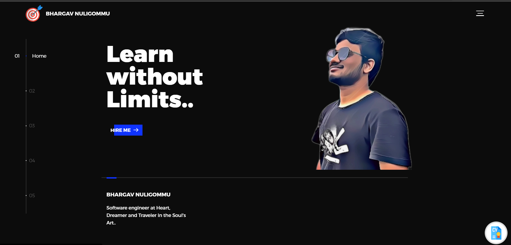

# Bhargav Nuligommu  

## My Portfolio Website. 🐕

This is an attempt to explain the very complex being that I am, through the language of binary. 



**Link to the website** : https://bhargavnuligommu.com/

## Getting Started 🎧

This project utilized the benefits of multiple technologies such as Javascript , HTML5 , CSS , SCSS.

Its better if we familiarize ourselves with these technologies. 

## Installing☔

Its pretty straightforward :

**Clone the repo :** 
```
git clone <repository Url>
```

## Deployment 💡

**Run the application** 
```
Use live server extention in vscode.
```

## Built With 🎯
**A lot of love and a little JavaScript**

## Contributing 

Make Pull requests which improve the functionality of the application in any sorts. It should conform with the following conditions. 
* Clear , short , crisp description of the PR. 
* Should add on to the value of the application.

## Who am I 🏅
I am From **New York**


## Acknowledgments 💖

* To my family👪  and friends 👫 who always kept me motivated.
* To the community of computer science 💻.

